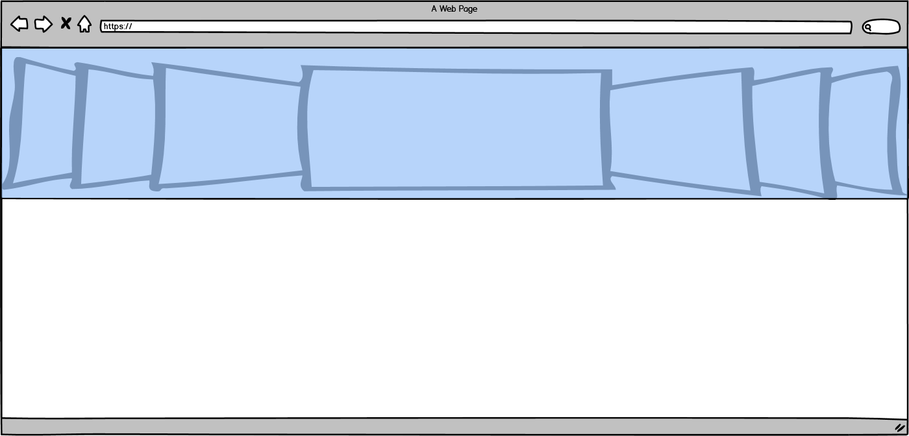
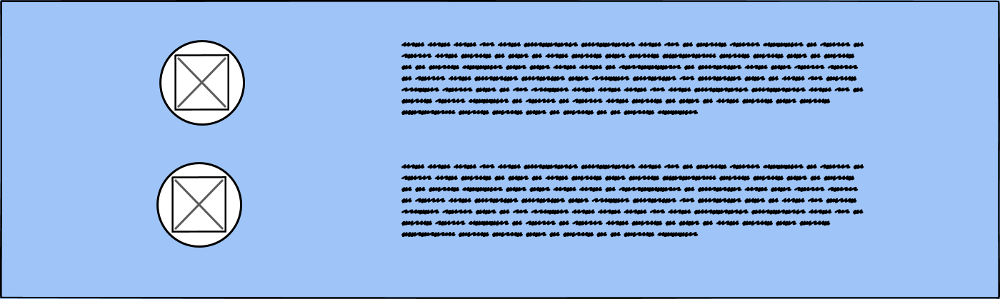
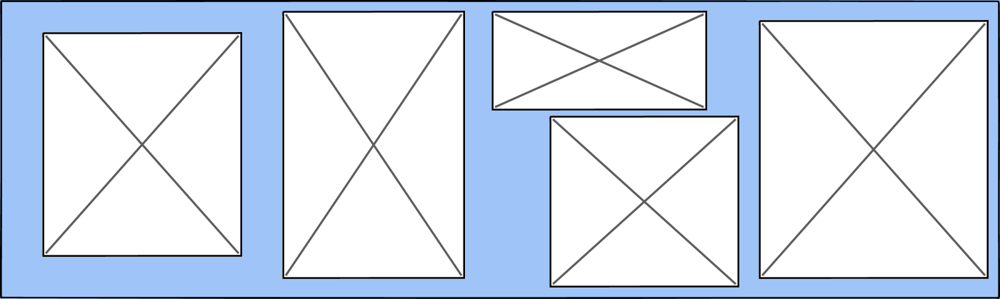
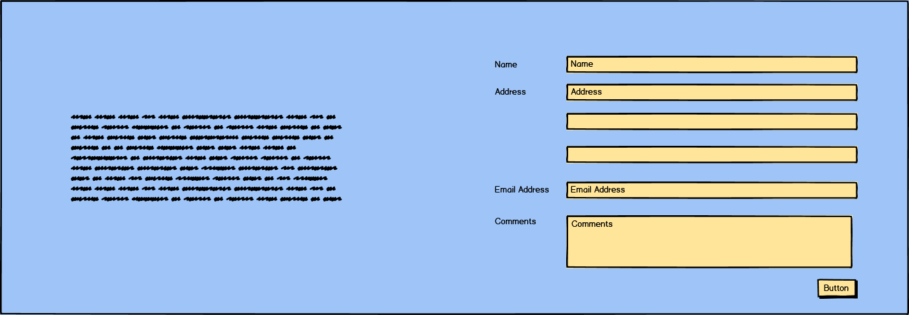
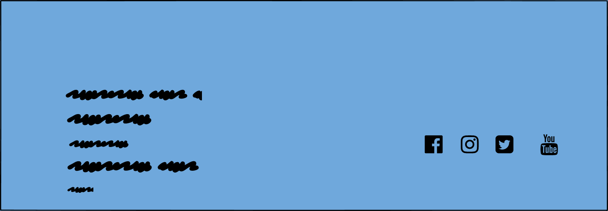
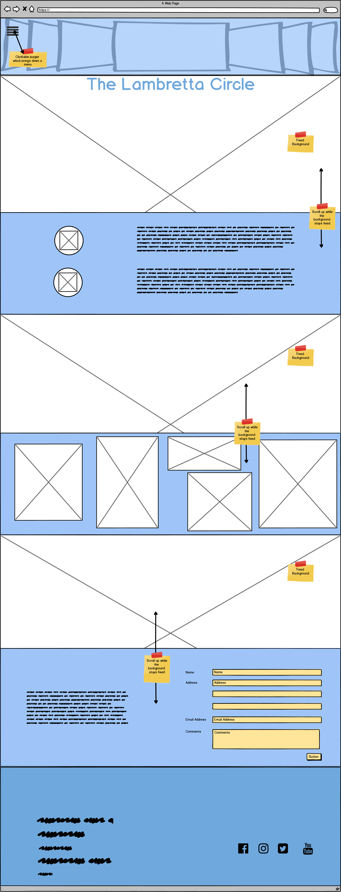
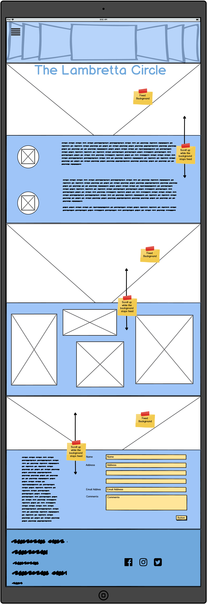
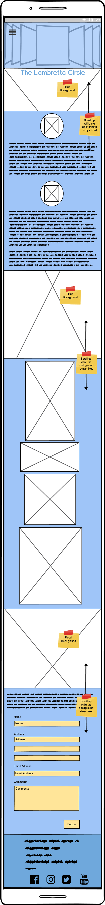

# The Lambretta Circle

---

## Aim of the site

The Lambretta Circle is more than just a website, where likeminded enthusiasts of lambretta owners
can find all the imformation about their local club and social events.

With the easy and intuitive navigation menu, the user can find themself inmerse in a world of Lambrettas to either find information about the club or social events. Where they can submit their interest to join.

---

## UX

This is a website where the user can find information about a Gloucestershire lambretta social club.

* The visitors can submit their details to join the club.
* The visitors can see a gallery of photos about Lambrettas.
* The visitors can find out where will be the future social events.

In order to achieve this, the client wanted a website which meets the following criteria:

1. A maximum 3 pages long website.
2. Plain simple colors theme with blue and white feel.
3. Small amount of photos displaying Lambrettas.
4. A couple of comments from members about the club and the social events organised in the past.
5. A form where the visitors can submit their details and comments to join the club as members.

---

## Client Stories

"Another visitor wanted to read about the experience of other users."

"A visitor wanted to see photos of other lambrettas in the club".

"A visitor wanted to find out more information about the social events by submiting a form."

"An visitor wanted links to the different social media."

---

## Features

### - A slide of photos

* Three Images slide on a carousel style at the top of the website

### - Members Experience 

* A couple of members comments about the club and their experience in social events.

### - Gallery 

* A showdown of images of Lambrettas

### - Contact Form.

* A form where the visitor can submit their details and possible comment about the website or interest to join the club

### - Address and Social Media links

* The address and social media 

### - Burger dropdown menu

* A burger style where a dropdown menu with 3 choices "Home", "Gallery", "About Us". Links to be implemented in the future.

## Wireframes Mockups:

### Desktop

 

### Tablet

 

### Mobile

---

## Future Goals

* The introduction of another page where members can post their own images and comments of social events they have taken part, either with the club or a different organiser.

* The implementation of a drop down menu from a burger icon fixed at the top.

---

## Technology Used

* HTML & CSS programming languages
* [Bootstrap](https://getbootstrap.com/) - to easily adapt the website to be responsive for all users
* [Google Fonts](https://fonts.google.com/) - Chango and Mukta Styles
* [Font Awesome](https://fontawesome.com/) - Social Media Logos
* [GIT](https://git-scm.com/) - Version Control
* [GitHub](https://github.com/) - to host the repositories for this project and the live website preview
* [Balsamiq Wireframe](https://balsamiq.com/) - to create the Wireframes Mockups
---

## Testing

### Issues and resolutions

---

## Deployment

## Credits

### Content

### Acknowledgements

## Disclaimer
Please note the content and images on this website are for educational purposes only.